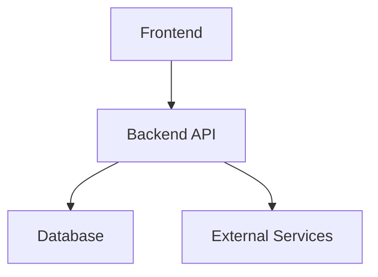

# 📚 Project Wiki - {{PROJECT_NAME}}

> **Living Documentation** | Auto-maintained by AI Agents

---

## 🏠 Home

Welcome to the **{{PROJECT_NAME}}** wiki. This documentation is automatically updated as the project evolves.

**Quick Links**:
- [Architecture](#architecture)
- [API Reference](#api-reference)  
- [Data Models](#data-models)
- [Development Guide](#development-guide)

---

## 🏗️ Architecture

### System Overview



_Architecture diagrams will be auto-generated as modules are created._

### Technology Stack

| Layer | Technology |
|-------|------------|
| Frontend | {{FRONTEND_TECH}} |
| Backend | {{BACKEND_TECH}} |
| Database | {{DATABASE_TECH}} |
| Deployment | {{DEPLOYMENT}} |

---

## 🔌 API Reference

### Endpoints

_API documentation will be auto-generated as endpoints are created._

**Example**:
```
GET /api/users
POST /api/users
PUT /api/users/:id
DELETE /api/users/:id
```

---

## 📊 Data Models

### Core Entities

_Data models will be documented here as they're defined._

**Example**:
```typescript
interface User {
  id: string;
  email: string;
  createdAt: Date;
}
```

---

## 👨‍💻 Development Guide

### Setup

```bash
# Clone the repository
git clone [repo-url]

# Install dependencies
npm install

# Run development server
npm run dev
```

### Testing

```bash
# Run all tests
npm test

# Run with coverage
npm run test:coverage
```

---

## 📝 Decision Log (ADRs)

### ADR-001: [Decision Title]

**Date**: {{DATE}}  
**Status**: Accepted  
**Context**: _Why was this decision needed?_  
**Decision**: _What was decided?_  
**Consequences**: _What are the implications?_

---

## 🔗 Related Resources

- **Repository**: [GitHub/GitLab link]
- **Deployment**: [Production URL]
- **Design**: [Figma/Design link]

---

**Last Auto-Update**: {{TIMESTAMP}} by {{AGENT_NAME}}
