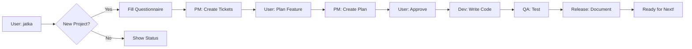

# 🚀 Quick Start Guide - Antigravity Factory Ultra

## For New Users

### 1. Copy Templates to Your Project

```bash
# Navigate to your new project
cd my-new-project

# Copy factory templates
cp -r /path/to/antigravity-factory-ultra/dist/.factory-templates ./
```

### 2. Start Antigravity

Open your project in Antigravity IDE and start a new conversation.

### 3. Initialize

Simply say:

```
jatka
```

The factory will detect you're starting fresh and guide you!

---

## Example First Session

```
YOU: jatka

FACTORY:
🏭 Antigravity Factory Ultra v1.0

📊 Project Status: NOT INITIALIZED
📍 Next Step: Set up your project

I don't see any project artifacts yet. Let's get started!

I've created a questionnaire. Please fill it out:
[Opens: project_init.md]

---

YOU: [fills in project details] done

FACTORY:
✅ Project initialized! Here's your setup:

**Project**: TaskMaster Pro
**Goal**: Build a task management app for teams
**First Feature**: User Authentication

📋 Created ticket board
📚 Wiki ready

What would you like to do?
• "Plan authentication" - Create implementation plan
• "Show backlog" - View tickets
• "Status" - See project overview

---

YOU: plan authentication

PM AGENT:
Creating implementation plan for authentication...

[Task Boundary: PLANNING]
- Analyzing requirements
- Defining architecture
- Creating security review

✅ Implementation plan ready!
[Opens: implementation_plan.md]

Please review and approve.

---

YOU: approve

DEV AGENT:
[Task Boundary: EXECUTION]
Starting development...

✅ Created: src/auth/login.js
✅ Created: src/auth/register.js
✅ Created: tests/auth.test.js
✅ Running linter... PASS
✅ Running tests... 42/42 PASS

Handing off to QA Agent...

---

QA AGENT:
[Task Boundary: VERIFICATION]
Running quality checks...

✅ Tests: PASS (100% coverage)
✅ Lint: PASS
✅ Starting browser validation...

[Launches browser_subagent]
Testing login flow... ✅
Testing registration flow... ✅
Capturing video...

All checks passed! Moving to Release Agent.

---

RELEASE AGENT:
[Task Boundary: VERIFICATION]
Finalizing feature...

✅ Updated CHANGELOG.md
✅ Updated wiki
✅ Generated sprint dashboard

[Creates: session_summary.png]

🎉 Feature complete!

See walkthrough.md for full details.

---

FACTORY:
Sprint 1 completed!

📊 Status: READY
📋 Backlog: 2 tasks remaining

What's next?
• "Plan payment system"
• "Continue" - Work on next task
• "Show summary" - See what we built
```

---

## Common Commands Cheat Sheet

| Command | What It Does | When to Use |
|---------|-------------|-------------|
| `jatka`, `continue` | Resume/initialize | Start of session |
| `plan [feature]` | Create implementation plan | Before building new feature |
| `approve` | Approve current plan/change | After reviewing plan |
| `reject` | Send back for changes | If plan needs revision |
| `start sprint` | Begin next ticket | When ready to code |
| `status` | Show detailed progress | Check project state |
| `show backlog` | View all tickets | See what's queued |
| `pause` | Save checkpoint | End of session |

---

## Understanding the Workflow



---

## Tips for Best Results

### ✅ Do This

- **Be specific**: "Plan user authentication with JWT" vs "make login"
- **Review plans**: Always check implementation_plan.md before approving
- **Use "status" often**: Stay informed about progress
- **Let agents finish**: Wait for task boundaries to complete
- **Trust the process**: Agents enforce quality gates for good reason

### ❌ Avoid This

- **Skipping plans**: Jumping straight to code without PM approval
- **Ignoring QA**: Bypassing test requirements
- **Vague requests**: "Make it better" - be specific!
- **Manual file edits**: Let agents manage artifacts

---

## What Each Agent Does

### 🎯 PM Agent (PLANNING)
**Triggers**: "plan [feature]", new project setup  
**Creates**: tickets.md, implementation_plan.md  
**Blocks**: Won't allow code without approved plan

### 🏗️ Architect Agent (PLANNING)
**Triggers**: Complex features, design reviews  
**Creates**: Architecture diagrams, wiki updates  
**Validates**: Design patterns, security

### 💻 Dev Agent (EXECUTION)
**Triggers**: Approved implementation plan  
**Creates**: Source code, tests, comments  
**Enforces**: Linting, code standards

### 🧪 QA Agent (VERIFICATION)
**Triggers**: Dev completes code  
**Runs**: Tests, linter, browser validation  
**Blocks**: Won't pass without passing tests

### 📝 Release Agent (VERIFICATION)
**Triggers**: QA approves  
**Creates**: Changelog, walkthrough, dashboard  
**Generates**: Visual summaries, session reports

---

## Troubleshooting

### "I said 'jatka' but nothing happened"

Check that you're in a conversation with Antigravity. The factory artifacts live in:
```
.gemini/antigravity/brain/<conversation-id>/
```

### "Agent is blocked/stuck"

Usually means you need to approve something. Check for:
- implementation_plan.md awaiting approval
- QA failures needing fixes
- Missing information in questionnaire

### "Can I edit artifacts manually?"

Yes, but let agents update them when possible. If you edit:
- `task.md` - Agents will respect your changes
- `tickets.md` - Agents will sync with this
- `implementation_plan.md` - Re-approval may be needed

---

## Next Steps

1. **Initialize your first project** (see example above)
2. **Build your first feature** end-to-end
3. **Review the walkthrough** to see what was created
4. **Check the wiki** - it's already documenting your work!

---

**Ready to build the future?** 🚀

Just say: `jatka`
